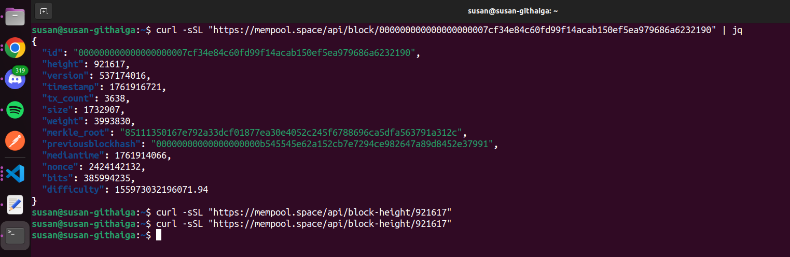

## Block Inspection

[Transaction block used ->](https://mempool.space/block/000000000000000000007cf34e84c60fd99f14acab150ef5ea979686a6232190?showDetails=true&view=actual)


Block Inspection Results
------------------------

| Field                  | Value                                                                 |
|-------------------------|------------------------------------------------------------------------|
| **Block Height**        | 921617                                                                 |
| **Block Hash**          | 000000000000000000007cf34e84c60fd99f14acab150ef5ea979686a6232190      |
| **Previous Block Hash** | 00000000000000000000b545545e62a152cb7e7294ce982647a89d8452e37991      |
| **Merkle Root**         | 85111350167e792a33dcf01877ea30e4052c245f6788696ca5dfa563791a312c      |
| **Number of Transactions** | 3,638 transactions                                                |
| **Timestamp**           | 2025-10-31 16:18:41                                                   |

<br>

---

To get the transaction details, run: 

```bash
curl -sSL "https://mempool.space/api/block/000000000000000000007cf34e84c60fd99f14acab150ef5ea979686a6232190" | jq

```

*Output:*



## Tools used

- [mempool.space](https://mempool.space/)
- [mempool.space APIs](https://mempool.space/docs/api/rest#get-block)