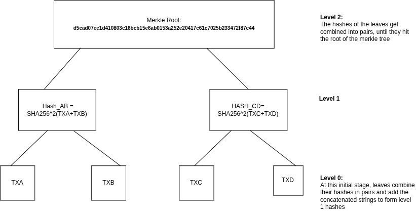

# Merkle Tree Construction

## Transaction Hashes (Leaves)

| TX # | Transaction ID (Hash) | Mempool Link |
|------|------------------------|--------------|
| TXA  | `264c80539c5de7d02cd92597ba2c3506579b3ca520c7069b09f0a40780f29184` | [View on mempool.space](https://mempool.space/tx/264c80539c5de7d02cd92597ba2c3506579b3ca520c7069b09f0a40780f29184) |
| TXB  | `88156ae21a364cc119b6b9c411b9c221155e2d48a81ea75fe7f94509f8d72039` | [View on mempool.space](https://mempool.space/tx/88156ae21a364cc119b6b9c411b9c221155e2d48a81ea75fe7f94509f8d72039) |
| TXC  | `999626ad6d2e9ee2f4ce260b309be236d73e0dbeafa7637565a56eb5e0f8cb7a` | [View on mempool.space](https://mempool.space/tx/999626ad6d2e9ee2f4ce260b309be236d73e0dbeafa7637565a56eb5e0f8cb7a) |
| TXD  | `884307d1888cd9f398bc683b24e51a2be212601333d05c71e661ebb7321369de` | [View on mempool.space](https://mempool.space/tx/884307d1888cd9f398bc683b24e51a2be212601333d05c71e661ebb7321369de) |

---

## Merkle Root (Top Hash)
`d5cad07ee1d410803c16bcb15e6ab0153a252e20417c61c7025b233472f87c44`

---


## Step-by-Step Calculation

i) Step 1: Start with Transaction Hashes (Level 0)

```bash
TXA = 264c80539c5de7d02cd92597ba2c3506579b3ca520c7069b09f0a40780f29184
TXB = 88156ae21a364cc119b6b9c411b9c221155e2d48a81ea75fe7f94509f8d72039
TXC = 999626ad6d2e9ee2f4ce260b309be236d73e0dbeafa7637565a56eb5e0f8cb7a
TXD = 884307d1888cd9f398bc683b24e51a2be212601333d05c71e661ebb7321369de
```

ii) Step 2: Calculate Level 1 Hashes

```bash
HASH_AB = Concatenate: TXA + TXB
             264c80539c5de7d02cd92597ba2c3506579b3ca520c7069b09f0a40780f29184 +
             88156ae21a364cc119b6b9c411b9c221155e2d48a81ea75fe7f94509f8d72039

First SHA256:  [binary hash]
Second SHA256: HASH_AB (3f4279b8ee4b8c31cf829c950d95c533f39196e11c2bb61f4286328318355150)

HASH_CD = Concatenate TXC + TXD
             999626ad6d2e9ee2f4ce260b309be236d73e0dbeafa7637565a56eb5e0f8cb7a +
             884307d1888cd9f398bc683b24e51a2be212601333d05c71e661ebb7321369de

First SHA256:  [binary hash]
Second SHA256: HASH_CD (a9fae086ad98316441448493ab895d6d3dbfc1d16368fc5299cb0a31ed5bebd1)
```

iii) Step 3: Calculate Merkle Root (Level 2)

```bash
Merkle root = Concatenate: HASH_AB + HASH_CD
            3f4279b8ee4b8c31cf829c950d95c533f39196e11c2bb61f4286328318355150 +
            a9fae086ad98316441448493ab895d6d3dbfc1d16368fc5299cb0a31ed5bebd1

Merkle root : d5cad07ee1d410803c16bcb15e6ab0153a252e20417c61c7025b233472f87c44
```


##  Merkle Tree Diagram



